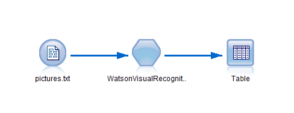
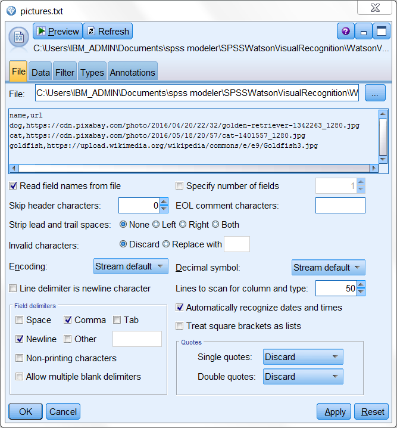
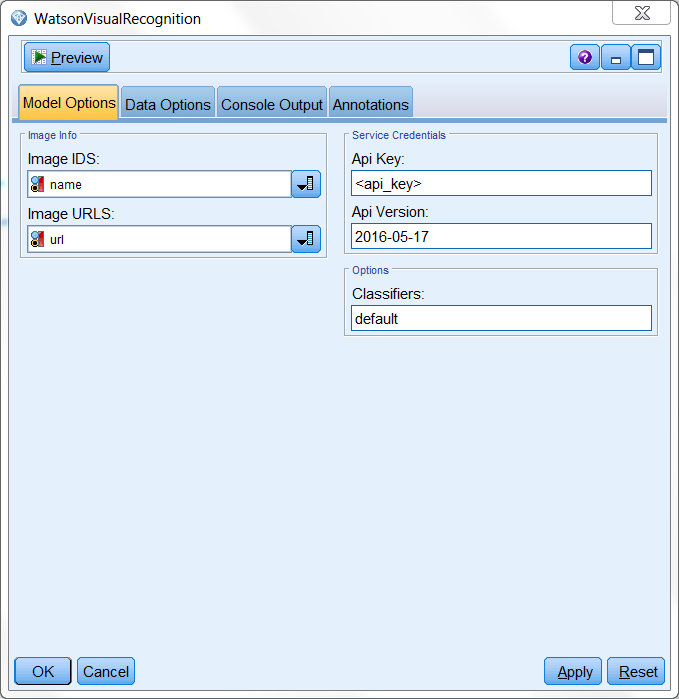
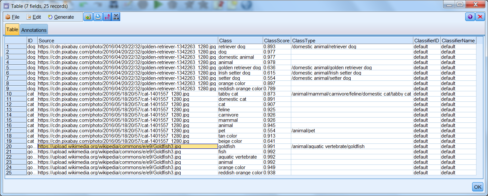

# Classify images with Watson Visual Recognition

This extension enables you to harness the power of machine learning and automatically analyze the contents of pictures.

  

service demo:
https://visual-recognition-demo.mybluemix.net/

# Before you start

1. Sign up an IBM Bluemix acount.

	https://console.ng.bluemix.net/registration/?target=%2Fdashboard%2Fapps
	
	or log in to an existing one
	
2. Create new app
	1. In your dashboard click on 'Create App'
	2. Find 'Visual Recognition'
	3. Fill out the form and proceed with 'Create' button
	
3. Aquire service 'api_key'
	1. On your service's main page click 'Service Credentials' tab.
	2. From the list choose your credentials and click on 'View Credentials'
	3. Copy Your 'api_key'.
	

4. SPSS Modeler and R requirements:
	- [SPSS Modeler v18.0][4]
	- [SPSS Modeler 'R essentials' plugin][3]
	- R packages: 
		- httr
		- RJSONIO
		- RCurl
		
5. Install WatsonVisualRecognition extension from SPSS Modeler Extension Hub.

You can now start classifying your images!

# Example usage

Example stream

  

Example images

    
  
  

WatsonVisualRecognition node requires a connected source. In our example a 'Var. File' node will be used.
The source must contain two columns of variables: one will be your pictures id or names, the other the urls you wish to classify.

  

	
In the node window you must provide the 'api_key' for your bluemix service and choose appropriate positions in the 'Image URLS' and 'Image IDS' fields.

Optionally you can specify custom classifier or api version. To learn more about custom classifiers check out: 
[WatsonCreateClassifier][9]

  

	
	
# Output

The generated output is a table that contains the picture ids, picture urls, class names and their respective scores. 
Note that for one image the number of generated table entries depends on the number of classes assigned to picture by the classifier.
	

  

Looking for pictures to classify? Try these extensions: [FacebookPhotoImport][7] and [InstagramPictures][8]
	
# License
- [Apache 2.0][1]

# Contributors
- Artur Kucia
- Mateusz Mika

 [1]: http://www.apache.org/licenses/LICENSE-2.0.html
 [3]: http://www.ibm.com/support/knowledgecenter/SS3RA7_18.0.0/modeler_r_plugin_install_project_ddita/clementine/programmability_option/r_essentials_install.html
 [4]: http://www-03.ibm.com/software/products/en/spss-modeler
 [7]: https://github.com/SpssModelerExtensions/FacebookPhotoImport
 [8]: https://github.com/SpssModelerExtensions/InstagramPictures
 [9]: https://github.com/SpssModelerExtensions/WatsonCreateClassifier
